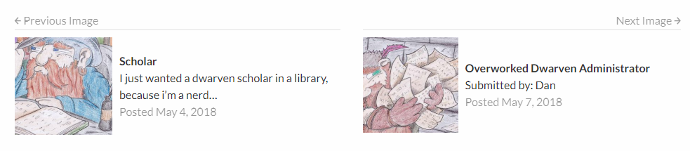

RS Next and Previous Posts
==

_Adds next and previous posts links with thumbnails, titles, and excerpts at the end of your post content._

    Contributors: radgh
    Donate link: https://paypal.me/radgh
    Tags: gravity-forms, css
    Requires at least: 4.1
    Tested up to: 4.9.5
    Stable tag: (none)
    License: GPLv3
    License URI: http://www.gnu.org/licenses/gpl-3.0.txt

## Description ##

Adds next and previous posts links with thumbnails, titles, and excerpts at the end of your post content. Also works on custom post types (except woocommerce products).

## Installation ##

1. Upload the plugin files to `/wp-content/plugins/rs-next-previous-posts/`.
1. Activate the plugin through the 'Plugins' screen in WordPress.
1. Enjoy, no configuration necessary.

## Frequently Asked Questions ##

None

## Screenshots ##

## Changelog ##

#### 1.0.0
* First release

## Upgrade Notice ##

None